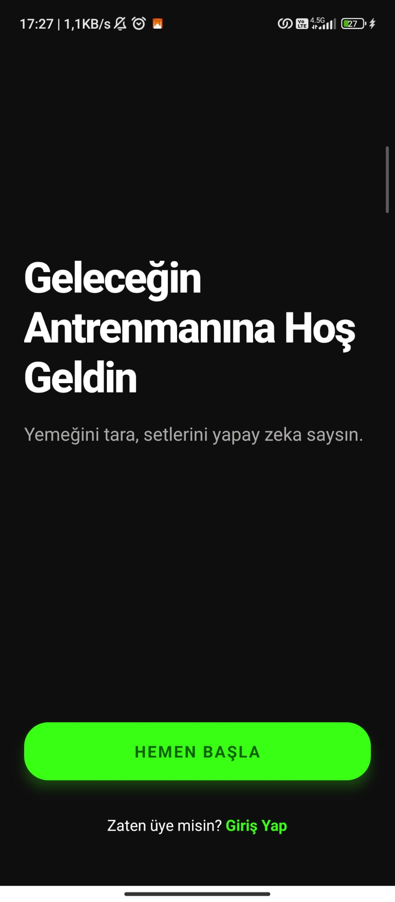
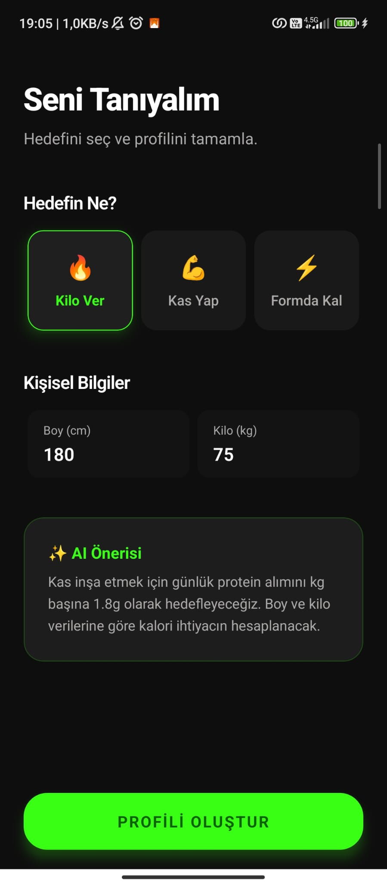

## İterasyon 1: Onboarding (Karşılama) Ekranı
- **Hedef:** Kullanıcıyı uygulamaya çekecek, fütüristik karanlık temalı bir giriş ekranı tasarımı ve entegrasyonu.
- **Araçlar:** Tasarım için Google Stitch, Kodlama için Google Antigravity ve Stitch MCP.
- **Kazanılan Ağırlık:** 5 kg (Basic UI screen)
- **Kanıt:** > 

## İterasyon 2: Hedef ve Profil Ekranı
- **Hedef:** Kullanıcıdan fiziksel verilerini ve fitness hedeflerini alan, karanlık temalı interaktif form ekranının oluşturulması. İlk ekran ile bağlantı kuruldu.
- **Araçlar:** Google Stitch, Antigravity, Stitch MCP.
- **Kazanılan Ağırlık:** 10 kg (Text input & UI)
- **Kanıt:** > 